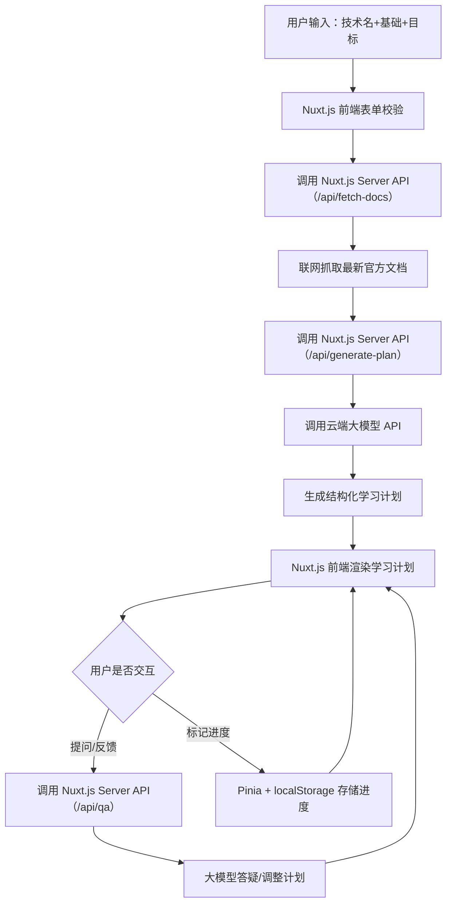

# Nuxt.js 技术学习Agent 开发需求文档
## 文档说明
本文档为基于 Nuxt.js 开发「通用型技术学习Agent」的完整需求说明，可直接提交至 Gemini 作为开发依据，涵盖核心目标、功能规格、技术架构、交互逻辑等关键内容，确保开发成果贴合“自学新技术+熟练 Nuxt.js”的双重目标。

## 一、项目核心目标
1. **核心功能**：开发一款通用型技术学习Agent，用户输入任意技术名称（无固定范围），Agent 自动联网抓取该技术最新官方文档，结合用户基础/学习目标，生成适配主流应用场景、可练习、可答疑、可巩固的系统化学习计划。
2. **技术约束**：全程基于 Nuxt.js（最新稳定版）开发，优先使用 Nuxt.js 生态核心能力（如服务端渲染 SSR/SSG、API 路由、服务器插件、Nuxt Modules 等），最大化利用 Nuxt.js 特性实现功能，助力开发者熟练掌握 Nuxt.js 技术栈。
3. **用户体验**：输出内容结构化、可落地，交互流程简洁，支持用户实时提问、反馈学习计划调整需求。

## 二、功能需求规格
### 2.1 核心功能模块（优先级1，MVP必实现）
| 模块名称       | 子功能                                                                 | 技术实现要求（Nuxt.js 相关）                                                                 |
|----------------|------------------------------------------------------------------------|---------------------------------------------------------------------------------------------|
| 1. 用户输入交互 | ① 接收用户输入：技术名称（支持版本）、自身基础（下拉选择：零基础/入门/进阶/精通）、学习目标（下拉选择：快速入门/项目实战/面试备考）、是否需要配套关联技术学习（单选：是/否）； ② 输入校验：必填项（技术名称）非空校验，输入格式提示； ③ 提交按钮：触发学习计划生成流程。 | ① 使用 Nuxt.js 组件（如 `<NuxtInput>` `<NuxtSelect>`）实现表单； ② 基于 Vue 3 响应式做输入状态管理； ③ 表单提交使用 Nuxt.js 内置的 `useFetch`/`useAsyncData` 触发后端逻辑。 |
| 2. 文档自动抓取 | ① 联网搜索：根据用户输入的技术名称，自动调用搜索引擎 API 抓取“技术名+最新官方文档”的权威链接（优先官网/docs/github）； ② 内容提取：解析抓取到的文档页面，提取核心内容（安装步骤、核心概念、API 参考、实战案例、常见问题），过滤过时信息； ③ 内容存储：临时存储抓取的文档文本（内存级，无需持久化），供大模型处理。 | ① 后端逻辑：在 Nuxt.js `server/api` 目录下编写爬虫接口，使用 Python 脚本（或 Node.js 库如 `cheerio`/`playwright`）实现抓取，通过 Nuxt.js 服务器路由暴露接口； ② 跨域处理：利用 Nuxt.js 内置代理解决爬虫跨域问题； ③ 异步处理：使用 Nuxt.js 服务器插件实现异步任务，避免前端阻塞。 |
| 3. 学习计划生成 | ① 大模型调用：将用户输入+抓取的文档内容传递给云端大模型 API（GPT-4o/通义千问/DeepSeek）； ② 结构化输出：大模型按指定格式生成学习计划，包含： - 技术核心定位（一句话说明技术价值）； - 主流应用场景（3-5个企业级场景）； - 配套关联技术（用户选择“是”时，列出2-3个常用配套技术及学习优先级）； - 分步骤学习计划（3-8步，每步含：必学知识点、实战小任务、3道检测题、避坑提示）； - 最小可运行代码模板（带注释）。 | ① 大模型调用：在 Nuxt.js `server/api` 目录下编写大模型调用接口，封装请求逻辑； ② 数据格式化：使用 Nuxt.js 工具函数处理大模型返回的 JSON/Markdown 内容，转为前端可渲染格式； ③ 状态管理：使用 Pinia（Nuxt.js 推荐）存储学习计划生成状态（加载中/成功/失败）。 |
| 4. 学习内容展示 | ① 格式化渲染：将学习计划以清晰的排版展示（分模块、折叠面板、代码高亮）； ② 代码交互：支持代码块复制、一键查看运行说明； ③ 响应式适配：适配PC/移动端，符合 Nuxt.js 响应式布局最佳实践。 | ① 组件封装：基于 Nuxt.js 封装学习计划展示组件（如 `<LearningStep>` `<CodeBlock>`）； ② 样式：使用 Nuxt.js 支持的 CSS 方案（如 Tailwind CSS，Nuxt 官方集成）； ③ 代码高亮：集成 `shiki`（Nuxt 推荐）实现代码语法高亮。 |

### 2.2 拓展功能模块（优先级2，MVP后迭代）
| 模块名称       | 子功能                                                                 | 技术实现要求（Nuxt.js 相关）                                                                 |
|----------------|------------------------------------------------------------------------|---------------------------------------------------------------------------------------------|
| 1. 交互式答疑   | ① 提问输入框：用户针对学习计划/文档内容输入问题； ② 答疑响应：基于抓取的文档内容+大模型，返回精准答疑结果，避免编造； ③ 报错解析：支持用户粘贴代码报错信息，返回原因+修复方案。 | ① 答疑接口：扩展 Nuxt.js `server/api` 目录下的大模型接口，新增答疑逻辑； ② 对话存储：使用 Nuxt.js 结合 localStorage 存储用户提问记录； ③ 实时反馈：使用 Nuxt.js 内置的 `useWebSocket` 实现提问实时响应（可选）。 |
| 2. 进度追踪     | ① 步骤标记：用户可标记学习步骤“已完成/未完成”； ② 进度展示：以进度条/列表形式展示学习完成度； ③ 巩固提醒：针对未完成步骤，推送简易巩固题。 | ① 状态存储：使用 Pinia + localStorage 持久化学习进度； ② 提醒逻辑：在 Nuxt.js 页面组件中实现提醒弹窗，基于路由守卫触发。 |
| 3. 内容导出     | 支持将学习计划导出为 Markdown/HTML 格式。                              | ① 导出逻辑：在 Nuxt.js 前端组件中实现，利用 `file-saver` 库，结合 Nuxt.js 静态资源处理能力。 |

## 三、技术架构与约束
### 3.1 技术栈（强制要求）
| 层级         | 技术选择                                                                 | 说明                                                                 |
|--------------|--------------------------------------------------------------------------|----------------------------------------------------------------------|
| 核心框架     | Nuxt.js（最新稳定版，如 Nuxt 3）| 全程使用 Nuxt.js 核心能力，优先使用官方推荐的 API/组件/生态。          |
| 前端         | Vue 3、TypeScript、Tailwind CSS（Nuxt 官方集成版）| 强类型开发，样式统一，符合 Nuxt.js 前端最佳实践。                     |
| 状态管理     | Pinia（Nuxt.js 官方推荐）| 替代 Vuex，管理用户输入、学习计划、加载状态等。                       |
| 后端接口     | Nuxt.js Server API（`server/api` 目录）| 所有后端逻辑（爬虫、大模型调用）均通过 Nuxt.js 服务器路由实现。       |
| 第三方依赖   | ① 爬虫：cheerio（静态页面）/playwright（动态页面）； ② 大模型：OpenAI/通义千问 SDK； ③ 搜索引擎：SerpAPI/百度搜索 API； ④ 代码高亮：shiki。 | 依赖安装需符合 Nuxt.js 依赖管理规范，优先使用 Nuxt Modules 集成。     |

### 3.2 架构流程（Mermaid 流程图）

### 3.3 关键约束
1. **Nuxt.js 特性利用**：
   - 优先使用 SSR 模式渲染学习计划页面，提升 SEO 和首屏加载速度；
   - 爬虫、大模型调用等耗时操作必须放在 Nuxt.js 服务器端（`server/api`），避免前端暴露密钥；
   - 使用 Nuxt.js 环境变量（`.env`）管理大模型 API Key、搜索引擎 API Key 等敏感信息。
2. **性能要求**：
   - 文档抓取超时时间≤10秒，超时后给出友好提示；
   - 学习计划生成响应时间≤15秒，加载过程显示进度条。
3. **兼容性**：
   - 支持主流浏览器（Chrome/Firefox/Safari）；
   - 移动端适配，符合 Nuxt.js 响应式设计规范。

## 四、交互与UI要求
1. **页面结构**：
   - 首页：输入表单（顶部）+ 学习计划展示区（主体）+ 答疑/进度模块（侧边/底部）；
   - 无学习计划时，展示引导文案和示例（如“输入「Next.js 14」体验学习计划生成”）。
2. **交互体验**：
   - 表单提交后显示加载动画，禁止重复提交；
   - 学习计划步骤支持折叠/展开，代码块支持一键复制；
   - 提问后实时显示“思考中”状态，答疑结果加载完成后自动展示。
3. **UI风格**：
   - 简洁工程师风格，以阅读效率为核心；
   - 主色调：中性色（黑/白/灰）+ 少量强调色（如蓝色）；
   - 符合 Nuxt.js 官方示例的 UI 设计风格，避免过度装饰。

## 五、交付物要求
1. **代码交付**：
   - 完整的 Nuxt.js 项目代码，包含 `pages` `components` `server` `composables` 等核心目录；
   - 代码注释清晰，符合 TypeScript 规范，关键接口/组件需标注用途；
   - 提供 `README.md`，包含环境配置、启动命令、API 说明。
2. **配置文件**：
   - 完整的 `.env.example` 文件（标注所需环境变量）；
   - `nuxt.config.ts` 配置合理，启用必要的模块（如 Tailwind CSS、Pinia）。
3. **测试用例**：
   - 提供至少3个测试用例（如“学习 Next.js 14”“学习 Docker 26.0”“学习 LangChain 0.2”），验证功能完整性。

## 总结
1. 本项目核心是基于 Nuxt.js 开发“通用技术学习Agent”，需实现「输入-抓文档-生成计划-交互答疑」全流程，且全程最大化利用 Nuxt.js 生态能力；
2. 功能优先级明确：先完成 MVP 核心模块（输入、抓文档、生成计划、展示），再迭代答疑、进度追踪等拓展功能；
3. 技术约束聚焦 Nuxt.js 最佳实践，敏感操作（爬虫、大模型调用）必须放在服务器端，保障安全性和性能。